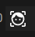

# Visage

Visage is a series of tools to do facial recognition on images (and create a searchable database). 


Mainly used in combination with [Stash](https://github.com/stashapp/stash)

# Stash Userscripts

Installation requires a browser extension such as [Violentmonkey](https://violentmonkey.github.io/) / [Tampermonkey](https://www.tampermonkey.net/) / [Greasemonkey](https://www.greasespot.net/).

**By default the userscripts only work for `http://localhost:9999`**

> If you access Stash from a different address, you will need to modify the userscript when you install it.
>
> Find the line `// @match       http://localhost:9999/*` and replace `http://localhost:9999/*` with your Stash address.

[INSTALL USERSCRIPT](userscript/visage.user.js?raw=1)

Once installed, A new icon will show on a scene's page next to the organized button.



# How do I use it?


# Running facial recognition locally (Optional)

By default, we use a externally hosted server to perform the facial recognition and return the responses.
The server doesn't have a GPU and isn't the fastest, so running a local instance of the API will speed up recognition.

`docker run -p "8000:8000" --gpus all cc12344567/faceserver`

Modify the userscript to point to your own server.

`url: "http://localhost:8000/recognise?results=3",`


# Create you own database

## Get a folder with images

using the following folder structure.

```
person_name
  - image_file_001.jpeg
  - another_01.jpeg
```

where `person_name` could be a person_name name or a UID, anything unique.

## run the hasher

First we need to download some weights so the model can run.

download the following to files and put them in `/hasher/weights`

```
https://github.com/serengil/deepface_models/releases/download/v1.0/facenet512_weights.h5
https://github.com/serengil/deepface_models/releases/download/v1.0/retinaface.h5
```

In the hasher folder, modify the docker-compose to point to your folder of images.
```
docker-compose build
docker-compose up
```

Once complete, It creates a sidecar file called <image name>.vector next to it each image.

## run the builder

To create the database that can be used to lookup, we use the `builder`

same thing as before, modify the docker-compose file.

```
docker-compose build
docker-compose up
```

This should give two files at the root of the folder you made available the container.

`face.db` and `face.json` these files are used by the next container.

## run the face matcher

Once again. modify the docker-compose.

It creates a <image name>.json file with 10 closest results


## Known issues and missing features

- [ ] No error messages are show in the UI
  - [ ] When no face can be detected
  - [ ] When no result is returned from the API
  - [ ] When creating a performer from stashbox but the local stash instance is giving a checksum error
- [ ] Scan a region of the screen to scan a single performer
- [ ] Scan for multiple performers
- [ ] On matches, link to stashbox so person can check other photo's of performer
